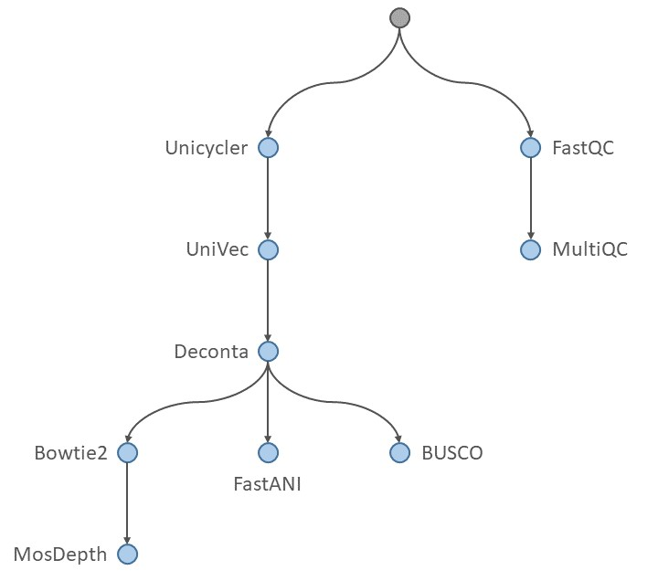

# CELIA

automatiC gEnome assembLy marIne prokAryotes

## Introduction

CELIA is a bioinformatics workflow used to automate the genome assembly for marine prokaryotes

## Requirements

- Have an account on Datarmor

## Quick start

More detailed will soon be available

## Wworkflow process

## License and Credits
MAEVA is released under the GNU Affero General Public License, Version 3.0. AGPL

It is developped by Alexandre Cormier, bioinformatics engineer at the bioinformatics service of IFREMER (SeBiMER).

-- (c) 2020 - SeBiMER, Ifremer
