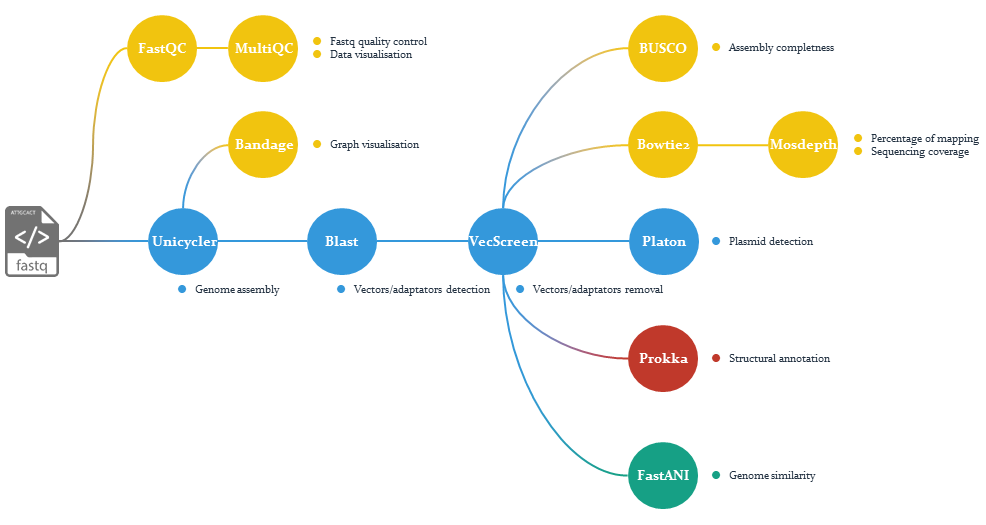

[]()
[]()
[](https://www.nextflow.io/)
[](https://gitlab.ifremer.fr/bioinfo/CELIA)

# Introduction

CELIA (automatiC gEnome assembLy marIne prokAryotes) is a bioinformatics workflow used to automate the genome assemblies of prokaryotes from Illumina data

For now, the workflow allows:
- to make a quality control of the data using FastQC and MultiQC
- to assemble the genome using Unicycler
- to remove contaminants (vectors, adpatators or PhiX) using NCBI UniVec database and python script developped by the SeBiMER
- to evaluate the assembly quality using BUSCO and the mapping coverage (Bowtie2 + MoseDepth)
- to compute ANI scores using dedicated database (FastANI)
- to make a structural annotation (Prokka)

## Quick start

1. Clone the current gitlab repertory in your working directory on DATARMOR

```
git clone https://gitlab.ifremer.fr/bioinfo/celia.git
```

2. Once on DATARMOR, edit the conf/params.config file with your analysis parameters or directly using arguments

3. Add a directory with your data (paired fastq.gz files)

4. Run the analysis

```
qsub celia.pbs
```

## Workflow process



## Further development

- Identify and isolate assembled plasmids (Platon)
- Functional annotation (Prokka)
- Generate HTML report

## License and Credits
CELIA is released under the GNU Affero General Public License, Version 3.0. AGPL

It is developped by Alexandre Cormier, bioinformatics engineer at the bioinformatics service of IFREMER (SeBiMER).

-- (c) 2020 - SeBiMER, Ifremer
