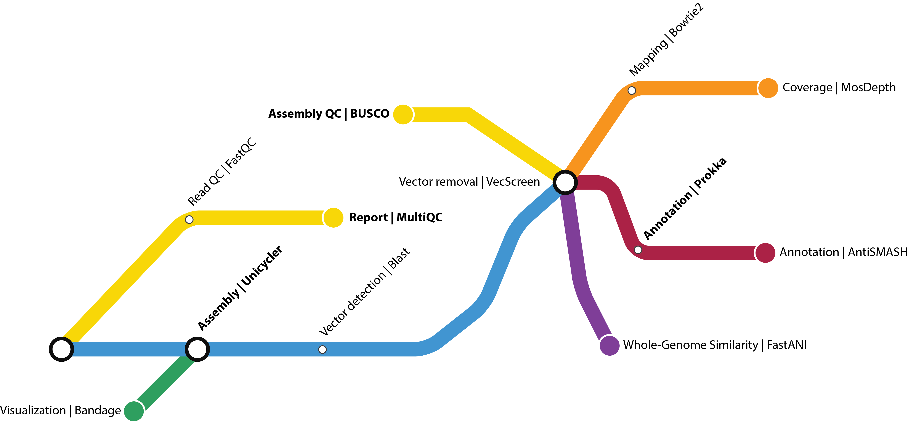

# **CELIA: automatiC gEnome assembLy marIne prokAryotes**

[](https://www.nextflow.io/)
[](https://www.docker.com/)
[](https://sylabs.io/docs/)

# Introduction

CELIA is a bioinformatics workflow used to automate the genome assemblies of prokaryotes from Illumina data

For now, the workflow allows:
- to make a quality control of the data using FastQC and MultiQC
- to assemble the genome using Unicycler
- to remove contaminants (vectors, adpatators or PhiX) using NCBI UniVec database and python script developped by the SeBiMER
- to evaluate the assembly quality using BUSCO and the mapping coverage (Bowtie2 + MoseDepth)
- to compute ANI scores using dedicated database (FastANI)
- to make a structural annotation (Prokka)
- to search for antibiotics and secondary metabolite (AntiSMASH)

## Dependencies

- Nextflow >= 20.04.x
- Singularity or Docker

## Quick start

1. Clone the current gitlab repertory in your working directory

```
git clone https://gitlab.ifremer.fr/bioinfo/celia.git
```

2. Add a directory with your data (paired fastq.gz files)

```
celia/
...
└── test_data
    ├── 1629_S50_L001_R1.fastq.gz
    ├── 1629_S50_L001_R2.fastq.gz
    ├── AMNU_S04_L001_R1.fastq.gz
    ├── AMNU_S04_L001_R2.fastq.gz
    ├── RTFM_S25_L001_R1.fastq.gz
    └── RTFM_S25_L001_R2.fastq.gz
```

3. Set the configuration file

```
vim conf/custom.conf
```

4. Run the analysis

```
nextflow run main.nf -profile custom,singularity
```

## Examples

- 1 - Run using Singularity on a local computer/server

```
nextflow run main.nf -profile custom,singularity --projectName run-test --rawdata_dir "test_data/*_R{1,2}.fastq.gz"
```

- 2 - Same with HPC configuration

```
nextflow run main.nf -profile custom,singularity -c /appli/bioinfo/hpc/nextflow/ifremer.config
```

- 3 - Restart a run partially failed
```
nextflow run main.nf -resume -profile custom,docker -c /appli/bioinfo/hpc/nextflow/ifremer.config
```


## Workflow process



## License and Credits
CELIA is released under the GNU Affero General Public License, Version 3.0. AGPL

It is developped by Alexandre Cormier, bioinformatics engineer at the bioinformatics service of IFREMER (SeBiMER).

-- (c) 2020 - SeBiMER, Ifremer
